# Lab 2 说明文档 23302010034 傅子澈

## 新增设计模式和底层

### 文件节点以及其管理器

实现通用的树节点接口的AbstractFileNode、具体的FileNode和DirectoryNode以及FileTreeManager，用于维护文本的树结构。


### 装饰器模式

``` java
public interface Decorative {
    public void addDecorator(Decorator decorator);

    public void removeDEcorator(DecoratorType type);

    public Decorator getDecorator(DecoratorType type);
    
} 

public abstract class Decorator {
    protected DecoratorType type;

    public Decorator(DecoratorType type){
        this.type=type;
    }

    public DecoratorType getType(){
        return type;
    }
} 

```

实现了装饰器链，允许通过添加不同的装饰器支持对Html元素id显示(show-id)、拼写检查处理以及文件更新状态等功能（参考Html的CSS样式）。特定操作会检查与其相关的装饰器。

### 策略模式结合适配器模式

新增ChildrenProvider\FeatureProvider、PrefixProvider、SuffixProvider、TextProvider以及组装用的具体到provider。在缩进显示中，策略将会根据TreeNode类型选择合适的适配器并得到其Prefix、Suffix和Feature用于同时支持打印Html树和文件树；同理，树形显示适配器会得到Text、Feature并支持不同类型树形结构的打印。

## 新功能实现支持

### 支持多个文件编辑

#### 实现思路

封装单个HtmlEditor,包含了其HtmlDocument、文件节点、命令管理器以及updated等基本属性。并由一个manager统一管理。在此基础上，Controller实现了新增命令。

#### load

替代原本的read指令

```java
public HtmlEditor loadEditor(String filePath,FileTreeManager fileManager) throws IOException{
    
    AbstractFileNode node=fileManager.getNodeById(filePath);
    if(node==null){
        HtmlDocument newDocument=new HtmlDocument(FileTreeManager.getBasename(filePath), "new file", new HtmlService());
        fileManager.addNode(filePath);
        var editor=addEditor(newDocument,(FileNode)fileManager.getNodeById(filePath));
        editor.setUpdated(true);
        editor.setFileExist(false);
        editor.notifyObservers(new StatusEvent("Successfully load file from "+filePath,true));
        return editor;
    }else{
        HtmlDocument document=controller.getIOManager().read(fileManager.resolvePath(filePath),new HtmlService());
        var editor=addEditor(document,(FileNode)node);
        editor.notifyObservers(new StatusEvent("Successfully load file from "+filePath,true));
        return editor;
    }
}
```

首先检查对于文件是否存在，若存在直接加载文件内容，若不存在则新建一个文件。

在load命令类里，会调用该函数并存入editor。如果捕获异常，会通知更新失败。

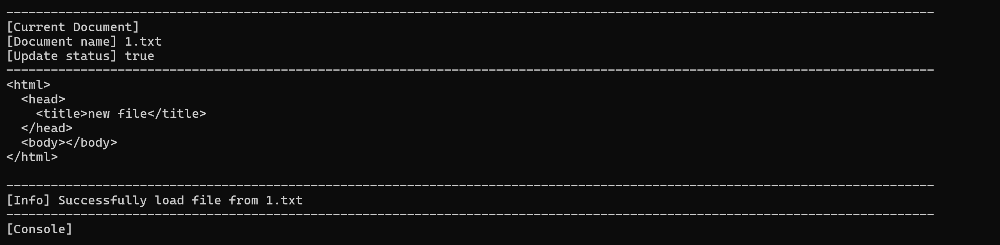
载入新文件
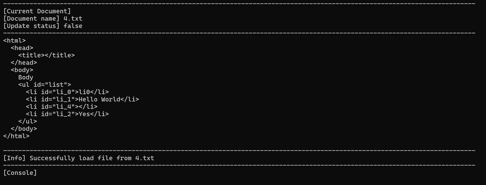
载入已有文件
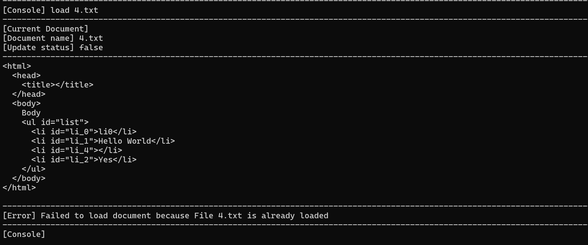
重复载入文件

#### save

```java
public void saveEditorToFile(HtmlEditor editor) throws IOException{
        
    var document=editor.getDocument();
    var prevStrategy=document.getRepresentationStrategy();
    document.setRepresentationStrategy(new HtmlIndentedRepresentation());
    controller.getIOManager().write(document,editor.getFileNode().getAbsolutePath());
    document.setRepresentationStrategy(prevStrategy);
    editor.setUpdated(false);
    editor.setFileExist(true);
}
```

该命令直接调用上一次lab已有的IO管理器并存入文件。在存入的时候会固定将显示方式设置为Indent并在储存结束后恢复。save操作会恢复文件的修改状态为False。

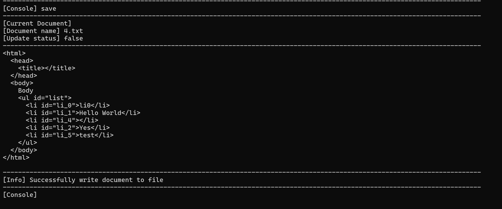

保存文件


#### close

```java
public void closeActiveEditor(){
    if(documentManager.getActiveEditor().isUpdated()){
        view.displayMessage("Do you want to save active file?[yes/no]");
        view.displayMessageInOneLine("");
        boolean isiSave=parser.confirmCommand();
        if(isiSave){
            saveFile();
        }
        documentManager.getActiveEditor().setUpdated(false);
    }
    boolean changeSuccess=documentManager.removeActiveEditor();
    
    if(changeSuccess){
        view.updateView(documentManager.getActiveEditor());
        view.displayInfo("Editor closed");
        view.displayInfo("Switch active editor to "+documentManager.getActiveEditor().getFileNode().getName());
    }else{
        view.clearConsole();
        view.displayInfo("Editor closed");
        view.displayInfo("There are no active editors now");
    }
}
```

close命令会检查对应编辑器是否被更新，并调用parser决定是否储存文件。
close结束后，会尝试切换编辑器并通知用户是否还有活动的编辑器。

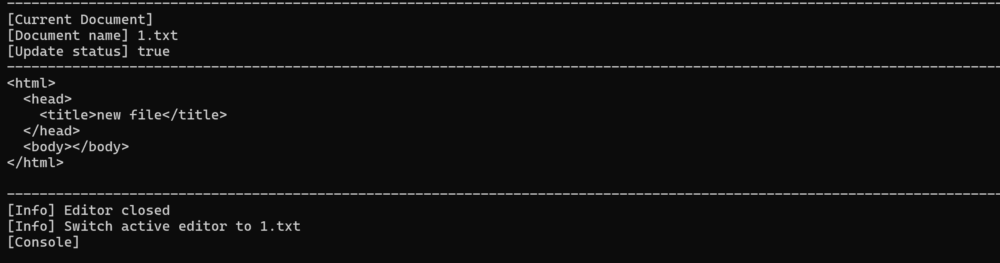
关闭文件示例

#### editor-list

HtmlDocumentManager实现对于Editor的迭代器模式

```java
@Override
public Iterator<HtmlEditor> iterator() {
    return editors.values().iterator();
}
```

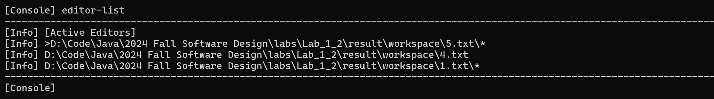

在此基础上，实现对于editor的打印

```java
public void listEditors(){
    var editors=documentManager.getEditors();
    view.displaySplitLine();
    view.displayInfo("[Active Editors]");
    for(var editor:editors.values()){
        String prefix="";
        String suffix="";
        if(editor.equals(documentManager.getActiveEditor())){
            prefix=">";
        }
        if(editor.isUpdated()){
            suffix="*";
        }
        view.displayInfo(prefix+editor.toString()+suffix);
    }
    view.displaySplitLine();
}
```

打印时，根据lab要求会检查editor是否为活动编辑器，是否为已更新。


打印所有需要的editor


#### edit

```java
public void switchEditor(String path){
    String absolutePath=fileTreeManager.resolvePath(path);
    boolean switchSuccess=false;
    switchSuccess=documentManager.setActiveEditor(absolutePath);
    if(switchSuccess){
        documentManager.getActiveEditor().notifyObservers(new StatusEvent("Switch to active file "+absolutePath, true));
    }else{
        documentManager.getActiveEditor().notifyObservers(new StatusEvent("Failed to switch to file "+absolutePath+" check if the file is loaded", false));
    }
    }
```

该指令接受用户输入的path（可以为相对路径或绝对路径）并自动解析后切换
如果切换失败，会提示用户检查目标文件是否被装入。
如果切换成功，会提示用户切换成功。

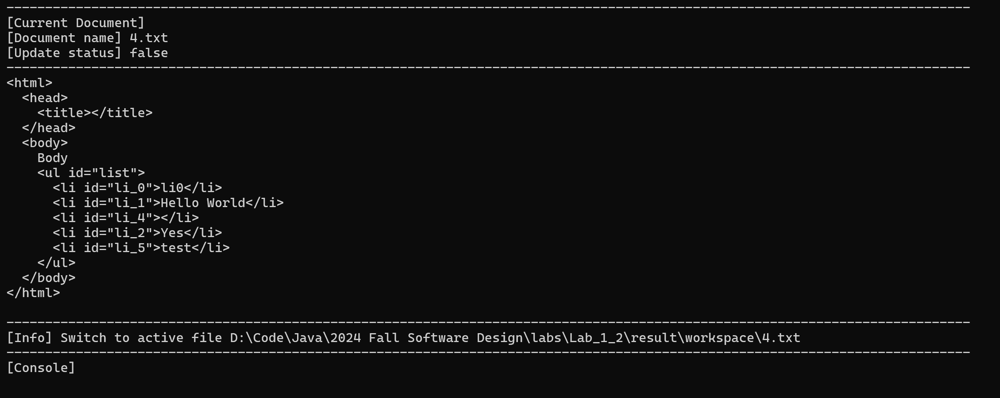
切换到其他编辑器

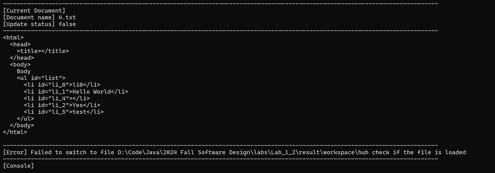
切换到不存在的编辑器

#### exit

该命令较为复杂，在文档后一部分会详细说明。

### Html树形打印的增强

#### 拼写检查和show-id设置

```java
public String getFeature(){
    HtmlComposite composite=(HtmlComposite)node;
    StringBuilder builder=new StringBuilder();
    builder.append(composite.getTagName().getTagString());
    HtmlSpellCheckDecorator decorator=(HtmlSpellCheckDecorator)composite.getDecorator(DecoratorType.HTML_SPELLCHECK_DECORATOR);
    if(decorator.hasSpellCheckErrors()){
        builder.append("[X]");
    }
    HtmlShowIdDecorator idDecorator=(HtmlShowIdDecorator)composite.getDecorator(DecoratorType.HTML_SHOWID_DECORATOR);
    if(idDecorator.isShowId()){
        builder.append(" #").append(composite.getId());
    }
    return builder.toString();
}
```

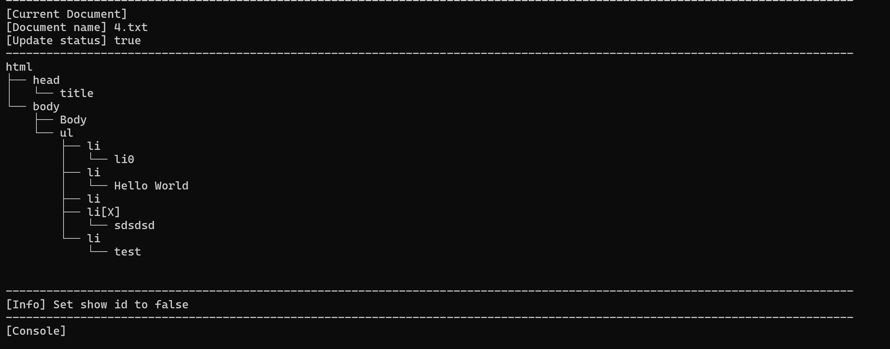
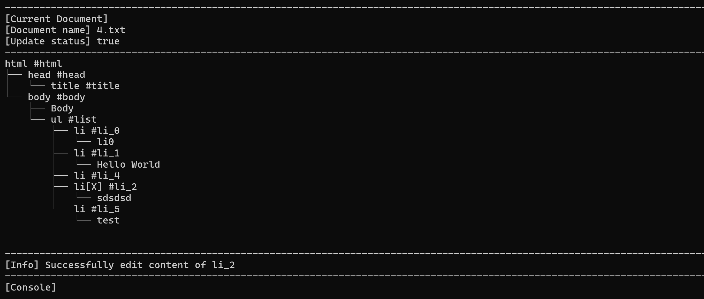

在适配器中会检查对应节点的拼写检查装饰器和show-id装饰器，并根据其状态决定是否显示。

##### 对于拼写检查的更新

为了保证拼写检查更新保持时效性，所有旧的编辑命令将会在更新成功的时候创建拼写检查访问者对其更新的元素进行重新拼写检查。 

在这里，不选择lab文档里提到的每次更新都执行拼写检查是因为：我的编辑器在每次执行指令后都会更新页面并进行呈现，因此，频繁的拼写检查有可能导致性能问题。选择在每个命令里对被更新的元素单独进行检查可以防止不必要的更新。但同时，也会增加代码量和耦合度。在实际使用中需要权衡。

##### 对于showid的全局储存

HtmlEditor储存了全局的showid属性，并提供以下方法

```java
public void setShowId(boolean showId){
    this.showId=showId;
    HtmlElementShowIdVisitor visitor=new HtmlElementShowIdVisitor(showId);
    document.visitRoot(visitor);
}
```

保证了外部对show-id的修改会反映到所有的Html元素上。每次视图的更新都会保证所有的元素都会保持正确的showid方式。

### 文件目录显示

在前文已经提到了文本树节点的创建以及两种基本打印策略
在这里只需要创建针对FileNode的适配器并应用到原有的打印策略，即可实现要求的功能。 

```java
 public String getFeature(){
    DirectoryNode dir=(DirectoryNode)node;
    StringBuilder builder=new StringBuilder();
    
    builder.append(dir.getName());
    FileNodeUpdateStatusDecorator decorator=(FileNodeUpdateStatusDecorator)dir.getDecorator(DecoratorType.FILE_NODE_UPDATE_STATUS_DECORATOR);
    if(decorator.getUpdateStatus()==true){
        builder.append("*");
    }
    return builder.toString();
}
```

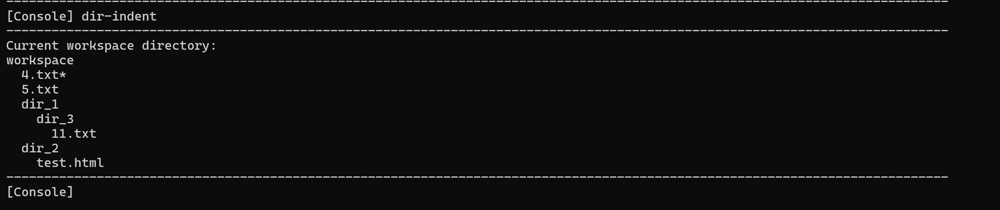
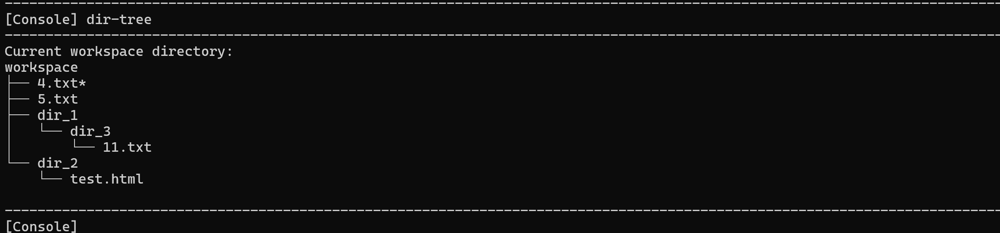

对于文件节点的feature如上，会检查更新状态装饰器以决定是添加*

### 文件更新状态

对于每个HtmlEditor,当执行了修改类指令后，会调整其更新状态为true，
更新状态通过装饰器反应在对应的文本节点上

```java
 public void execute(ConsoleCommand command){
    commandManager.executeCommand(command);
    if(command instanceof ConsoleUpdateCommand){
        var status=getLastStatusEvent();
        if(status.isSuccessful()){
            setUpdated(true,status);
        }
    }
}
```

同时，对于每一个单独的编辑器，当连续undo直到所有记录的更新指令均被撤销后，更新状态会重新变为false，redo则会设置其为true


### 恢复上一次编辑状态

在该次lab内，所有的工作去默认为./workspace/*，而在同一目录也会创建.html_editor文件夹，其中包含了对程序状态的储存

``` text
active_editor:D:\Code\Java\2024 Fall Software Design\labs\Lab_1_2\html_editor\workspace\5.txt
editor:D:\Code\Java\2024 Fall Software Design\labs\Lab_1_2\html_editor\workspace\5.txt
showid:true
editor:D:\Code\Java\2024 Fall Software Design\labs\Lab_1_2\html_editor\workspace\4.txt
showid:true
```

如图，文件会储存active的editor以及所有被打开的编辑器及其showid配置
如果需要更复杂的表现方式，可能可以使用json等方式储存

在exit时，将会遍历所有有修改的文件并询问是否保存，然后生成上述文本
如果新建的文件没有保存，最后会被丢弃，**不会**被记录在工作区状态

```java
public void recordAndExit(){
    try{
        List<HtmlEditor> editorToRemove=new ArrayList<>();
        for(var targetEditor:documentManager){
            if(targetEditor.isUpdated()){
                view.displayMessage("Do you want to save file "+targetEditor.getFileNode().getAbsolutePath()+" [yes/no]?");
                view.displayMessageInOneLine("");
                boolean saveEditor=parser.confirmCommand();
                if(saveEditor){
                    documentManager.saveEditorToFile(targetEditor);
                    view.displayInfo("Saving file to "+targetEditor.getFileNode().getAbsolutePath());
                }else{
                    editorToRemove.add(targetEditor);
                    view.displayInfo("Discarding file "+targetEditor.getFileNode().getAbsolutePath());
                }
            }
        }
        for(var ed:editorToRemove){
            documentManager.removeEditor(ed.getFileNode().getAbsolutePath());
        }
        HtmlEditorIO.saveEditors(documentManager, documentManager.getActiveEditor());
        view.displayInfo("History saved");
        view.displayInfo("Exiting Html Editor");
    }catch(IOException e){
        view.displayErrorMessage("Error Occurred when saving workspace info: "+e.getMessage());
    }
}
```

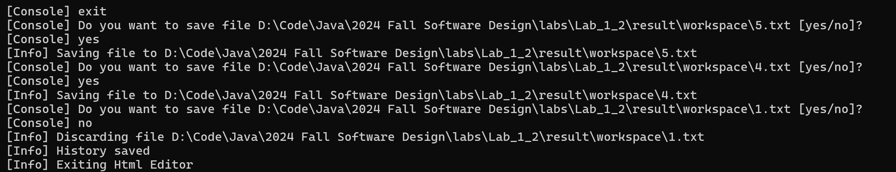

### 单元测试

在上一次lab测试的基础上，移除了被抛弃的命令（init、read和write）的单元测试，并添加了对于新设计模式和功能的测试。

#### 装饰器模式测试

主要考察添加到三种装饰器（Html元素的拼写检查和id显示装饰器，文件元素的更新装饰器）能否被正确的创建、读取和修改

#### 适配器模式测试

主要考察适配器能否表达出其包装的TreeNode的相关信息

#### 新增命令测试

主要包括在controller层直接调用函数检测功能正确性和在app层通过模拟用户输入检测功能正确性

```java
 @Test
    public void testFileOperations(){
        app.simulateInput("load 4.txt");
        app.simulateInput("load 5.txt");
        assert(app.getController().getActiveDocument().getDocumentName().equals("5.txt"));
        app.simulateInput("close");
        assert(app.getController().getActiveDocument().getDocumentName().equals("4.txt"));
        app.simulateInput("load 5.txt");
        app.simulateInput("exit");
        app.setIsRunning(true);
        assert(app.getController().getActiveDocument().getDocumentName().equals("5.txt"));
        assert(app.getController().getDocumentManager().getEditors().entrySet().size()==2);
        assert(app.getController().getDocumentManager().getActiveEditor().isShowId()==true);
        app.simulateInput("edit 4.txt");
        assert(app.getController().getActiveDocument().getDocumentName().equals("4.txt"));
        app.simulateInput("load test.html");
        app.simulateInput("showid false");
        assert(app.getController().getDocumentManager().getActiveEditor().isShowId()==false);
        app.simulateInput("save");
        assert(app.getController().getDocumentManager().getActiveEditor().isUpdated()==false);
        assert(app.getController().getDocumentManager().getActiveEditor().isShowId()==false);
        app.simulateInput("dir-tree");
        app.simulateInput("dir-indent");
        app.simulateInput("editor-list");

    }

```

上述是一个测试的示例，考察了load exit save showid以及恢复状态后的命令是否正确
对于打印类指令，只检查它是否能正常运行而不抛出异常。需手动在调试控制台检查格式是否符合预期。


### 其他功能

本次lab中添加了view的不同信息层级显示，包括[Console] [Info] [Error] [Success] ，
分别代表需要用户输入指令、指令执行中的信息（如成功添加元素）、指令执行产生的错误以及指令执行成功的提示。这一设计使得不同指令执行层次更加清晰。
