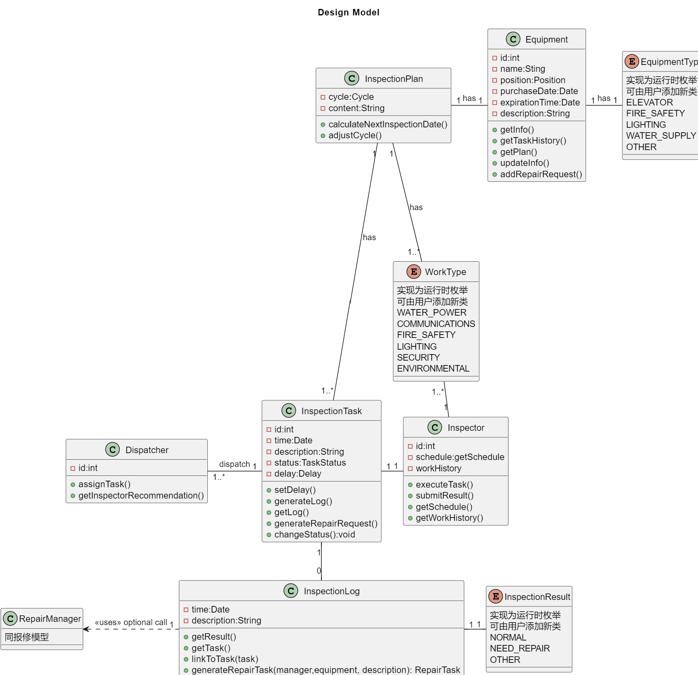
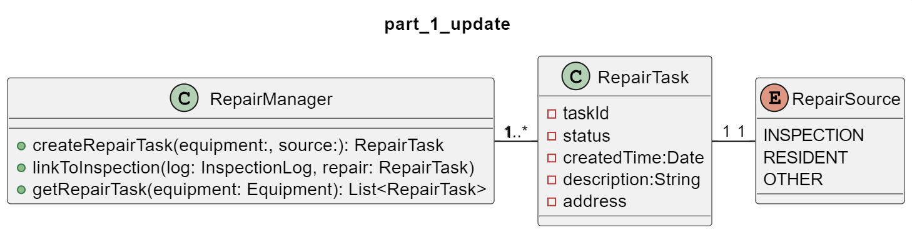

# 23302010034 lab3-2部分 提交说明

## 概述

本次lab在第一阶段的基础上，实现了对于巡检部分需求的设计模型
以下是对模型的简要阐述

## 主要部分：巡检

### 设备

设备类包含了每一台设备的所有要求的重要信息（作为属性）
对于复杂的属性，如Position以及日期相关，使用了辅助类进行实现，但因为与这个模型关系不大，所以仅标注了类型。

设备包含了一组动态的枚举（即允许用户在运行时动态添加类型）以标识设备的类型。每个设备含有一个类型。

设备可以关联到其巡检计划和所有相关的维修任务

### 巡检计划

每个设备关联到一个巡检计划，该计划拥有内容描述以及标准巡检周期，并提供一个函数来修正周期。

delay属性记录了其在周期上的延迟，对应计划在任务完成时会检查其是否需要延期以调整下一个周期。

一个巡检计划对应多个巡检任务，每当周期符合要求后便会自动生成任务。巡检任务介绍见下一节。

一个巡检任务结束后，计划会自动根据其结果以及执行状态生成下一个巡检任务（提供adjustTask函数来支持手动修改）

### 工作类型

同样为运行期枚举，指示了一个巡检计划对应的技能。这个枚举同样由巡检员持有。

### 巡检任务

巡检任务由巡检计划按照规定的周期以及临时调整生成。
巡检任务拥有id、时间、描述等基本属性；以及进行状态、延迟等复杂状态（通过辅助类实现）。
在初始阶段，巡检任务被标记为未开始，并根据巡检员工作逐渐更新为进行中、已完成。完成时，对应计划会检查其周期并更新delay。

巡检任务同样会对应一个巡检员，保证任务能够关联到员工

### 巡检日志和巡检结果

每个巡检任务在完成时会生成其巡检日志

每个日志都包含了一个巡检结果。其被定义为一个运行时枚举类。这个枚举包含了巡检结果为正常还是需要修理还是其他（可动态添加）；并包含了所有细节信息

如果巡检结果为需要修理，会调用RepairManager产生对应的维修任务。这个任务的来源将会被标注为INSPECTION

### 故障

巡检日志生成时，如果被记录为NEED_REPAIR，则会为设备生成一个或多个故障。该故障同时会被反馈给维修管理器以生成维修任务

故障记录器具体信息、严重程度以及其关联的维修任务（由维修管理器生成）

### 角色

调度员负责巡检任务，根据工作类型为每个活动的巡检任务分配可行的巡检员。调度员可以根据一个巡检任务获得巡检员推荐。

巡检员包含一个时间表（作为辅助类实现）以及一个历史工作（以此可以查询所有他/她负责的巡检任务）

巡检员角色可以执行task和提交结果来改变巡检任务的状态

## part I 增量部分：报修管理

在Lab1的模型中，添加一个报修管理类来统筹所有报修的管理

### 报修管理器

该管理器负责根据故障生成对应的维修任务，并将对应的设备与每个报修任务关联。同样，设备也可以查询到所有关联的维修任务。

对于每个报修任务，他会记录关联的设备和其维修的来源。维修来源是一组枚举，代表了来源是巡检、用户报修还是其他

## 对要求功能的支持情况

### 根据巡检计划完成调度

每个巡检计划会根据自身周期以及上一次任务的完成情况（如是否有delay）自动生成新的巡检任务。

### 关联工人和巡检任务

未分配巡检员的巡检任务会由调度员查询并分配技能适合、时间空闲的巡检员，从而完成一次调度。

巡检员和巡检计划共用一组动态枚举。每个巡检任务对应一个工作类型；每个巡检员拥有不同的工作类型。通过工作类型匹配合适的工人和巡检任务。

### 巡检工人查看自己的巡检任务

工人有工作记录，可查询到所有过去的巡检任务

### 查看设备的巡检记录

每个巡检计划会记录其所有巡检任务，支持查询

### 模型如何支持查看设备的故障记录

设备直接查询自己的故障即可。故障也会关联到其对应的维修任务，从而能够支持同时查询故障和维修状态